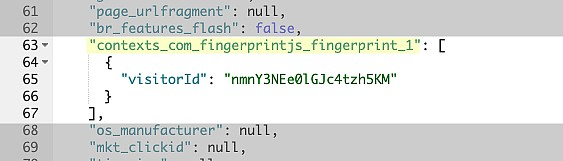
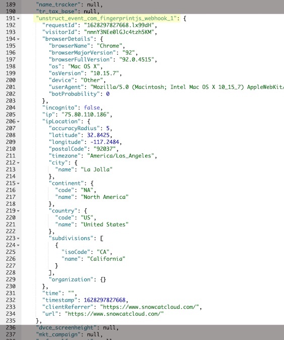

# Snowplow / SnowcatCloud Integration

### com.fingerprintjs schema registry

## Why use Snowplow with FingerprintJS Pro

[Snowplow](<[http://](https://github.com/snowplow/snowplow)>) is an open-source event data collection platform designed to collect event-level data from any digital device.
Like other event tracking platforms, it uses cookies to identify devices (domain_userid and network_userid).

[FingerprintJS Pro](https://fingerprintjs.com/) enables the identification of a device without cookies, deleted cookies, or even if the browser is in incognito mode.

The integration of Snowplow and FingerprintJS Pro is easy through Schemas, enabling the collection of all the regular Snowplow data, PLUS the additional metadata available from FingerprintJS Pro (device unique fingerprint).

[SnowcatCloud](https://www.snowcatcloud.com/) created schemas to support FingerprintJS integration into Snowplow, one for **fingerprint** and another for **webhooks**, so that you can ingest FingerprintJS events directly into your Snowplow data pipeline.

## Configuration

### Step 1

Before you can send events to Snowplow, install both [FingerprintJS schemas](https://github.com/SnowcatCloud/com.fingerprintjs-schema-registry) in your IGLU repository. SnowcatCloud already has FingerprintJS schemas installed.

- fingerprint (For use with FingerprintJS agent)
- webhook (For use with Webhooks)

### Step 2

#### Fingerprint

Refer to the [FingerprintJS Javascript Agent docs](https://dev.fingerprintjs.com/docs/js-agent) on installing the agent and obtaining the FingerprintJS visitorId.

Once the visitorId is available, you can fire the Snowplow event with the corresponding fingerprint schema.

```js
  // Creates a context with the fingerprintJS schema
  var Context = [
      {
      schema: "iglu:com.fingerprintjs/fingerprint/jsonschema/1-0-0",
      data: {
          visitorId: << FPJSVISITORID >>,
      },
      },
  ];

  // Fire an event with fingerprint context.
  snowplow("trackPageView", null, Context);
```

**WHERE** << FPJSVISITORID >> is the FingerprintJS visitorId.

#### Webhook

In the Fingerprintjs.com admin interface add a webhook with the following URL:

```
https://sp.collector.com/com.snowplowanalytics.iglu/v1?aid=fp-webhook&p=app&schema=iglu%3Acom.fingerprintjs%2Fwebhook%2Fjsonschema%2F1-0-0
```

Replace sp.collector.com for your Snowplow collector.

Example of a FingerprintJS fingerprint in Snowplow Mini (Elastic) :


Example of a FingerprintJS webhook in Snowplow Mini (Elastic) :

